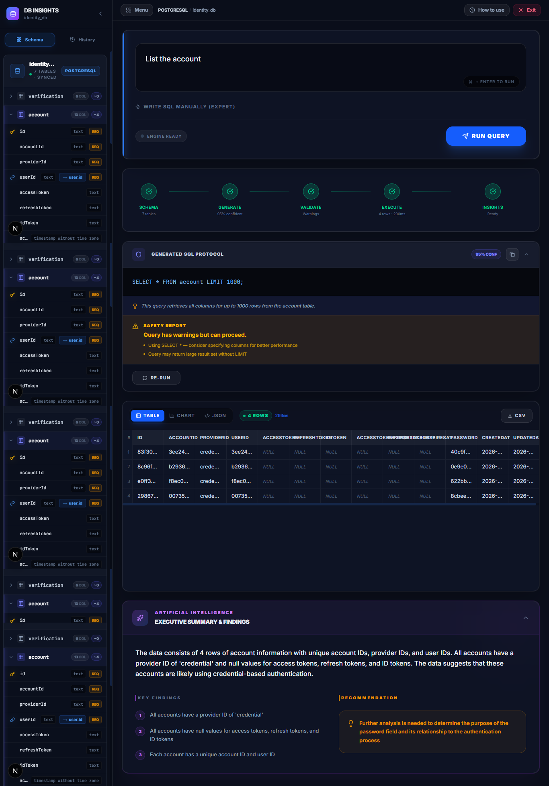
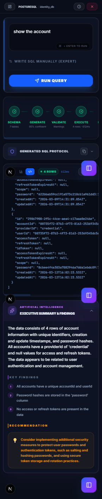

<div align="center">
  

# DB Insights

  **The Intelligent Bridge Between Natural Language and Your Database.**

  [](https://nextjs.org/)
  [](https://tailwindcss.com/)
  [](https://www.typescriptlang.org/)
  [](https://lucide.dev/)



<p><strong>Transform plain English into actionable SQL queries instantly.</strong></p>
  <p>Query, visualize, and analyze your data via <strong>zero-telemetry</strong> infrastructure powered by local AI.</p>
  <h1>DB Insights</h1>
  <p><strong>Transform plain English into actionable database queries instantly.</strong></p>
  <p>
    <a href="#features">Features</a> •
    <a href="#architecture">Architecture</a> •
    <a href="#quick-start">Quick Start</a> •
    <a href="#cli">CLI Options</a> •
    <a href="#contributing">Contributing</a>
  </p>

</div>

---

## 📱 Mobile-First Intelligence

Designed for the modern developer, DB Insights features a high-performance, fully responsive interface that brings the power of AI database analysis to your pocket.

<div align="center">
  
</div>

---

## ✨ Core Capabilities

### 🧠 AI-Native SQL Synthesis

Say goodbye to complex syntax. Employs context-aware prompt parsing to generate precise `SELECT` statements from natural language. Optimized for **Ollama** and **Qwen2.5-Coder**.

### 🗄️ Universal Multi-Engine Connectivity

Connect directly to your active environments with support for:

- 🐬 **MySQL**
- 🐘 **PostgreSQL**
- 🍃 **MongoDB** (Pipeline enabled)

### 📊 Advanced Data Storytelling

Visualize your query results with high-fidelity components:

- **Interactive Tables**: High-density data views with horizontal scrolling.
- **Dynamic Charts**: Instant Bar, Line, and Pie visualizations via Recharts.
- **Tree-View JSON**: Explorable structural data for deep debugging.

### 🛡️ Zero-Trust Security Model

Safety is non-negotiable.

- **Read-Only Enforcement**: Strict pattern matching blocks `DROP`, `DELETE`, `UPDATE`, and `ALTER`.
- **Local-First Data Plane**: 100% of execution and AI inference stays on your infrastructure.
- **Resource Constraints**: Server-side row caps and statement timeouts prevent engine overload.

---

## 🏗️ Architecture Stack

DB Insights operates on a decoupled architecture, orchestrating AI generation and DB execution through Next.js server endpoints to ensure client isolation.

```text
                        ┌───────────────────────────────┐
                        │      DB Insights Client       │
                        │    (Web UI / CLI Module)      │
                        └───────┬─────────────▲─────────┘
                                │             │
 [Natural Language Query]       │             │       [AI Synopsis]
                                │             │
                        ┌───────▼─────────────┴─────────┐
                        │       Next.js API Layer       │
                        │                               │
                        │  1. /api/schema               │
                        │  2. /api/generate (LLM)       │
                        │  3. /api/execute (Driver)     │
                        │  4. /api/insights (Analysis)  │
                        └───────┬─────────────┬─────────┘
                                │             │
                        ┌───────▼────┐   ┌────▼────────┐
                        │ Local LLM  │   │  DB Engine  │
                        │ (Ollama)   │   │ (PG/MySQL)  │
                        └────────────┘   └─────────────┘
```

---

## 🚀 Getting Started

### 1. Prerequisites

* **Node.js**: 20.x or higher
* **Local LLM**: [Ollama](https://ollama.ai/) running with `qwen2.5-coder:7b` (recommended)

### 2. Installation

1. **Clone the Repo**

   ```bash
   git clone https://github.com/your-username/db-insights.git
   cd db-insights
   ```
2. **Setup Dependencies**

   ```bash
   npm install
   ```
3. **Fire it up**

   ```bash
   npm run dev
   ```

Visit `http://localhost:3000` to start querying.

---

## 💻 CLI Integration

For power users, DB Insights includes a standalone CLI for terminal-native analysis.

```bash
cd cli
npm link
dbi ask "Who are my most active users?"
```

---

<div align="center">
  <p>Built with ❤️ for Data Engineers & Developers</p>
</div>
